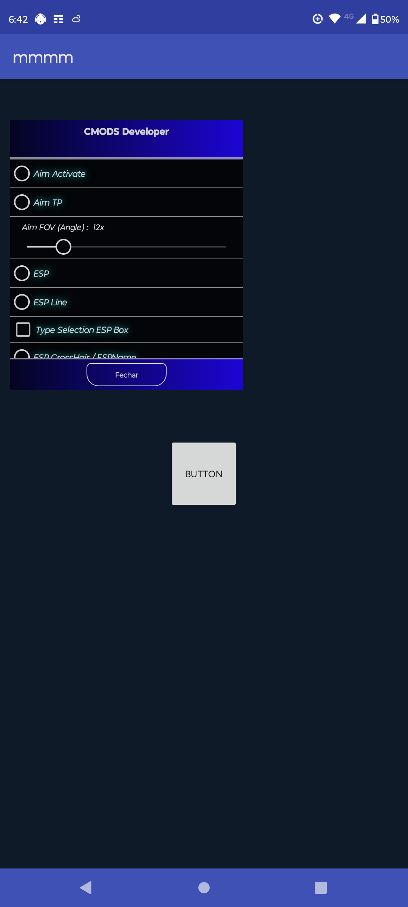
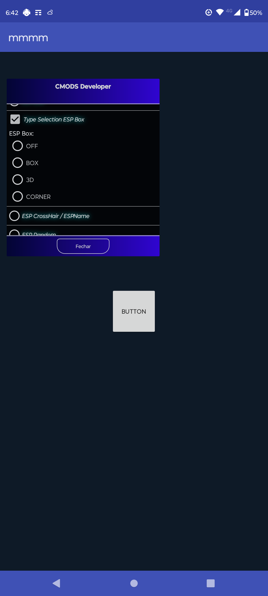

### Screenshots

 

### Features
- Supports dynamic colors on A12+.
- Supports Animations
- Animation Colors
- Watch history
- Supports Picture-in-Picture mode.
- [Material Design 3](https://m3.material.io/) Theme.

### Built with
- [Kotlin](https://kotlinlang.org/)
- [Java](https://dev.java/)
- [Coroutines](https://kotlinlang.org/docs/reference/coroutines-overview.html)
- [Android Architecture Components](https://developer.android.com/topic/libraries/architecture)
    - [LiveData](https://developer.android.com/topic/libraries/architecture/livedata)
    - [ViewModel](https://developer.android.com/topic/libraries/architecture/viewmodel)
    - [ViewBinding](https://developer.android.com/topic/libraries/view-binding)
    - [Paging3](https://developer.android.com/topic/libraries/architecture/paging/v3-overview)
- [Room database](https://developer.android.com/jetpack/androidx/releases/room)
- [Material Components for Android](https://github.com/material-components/material-components-android)
- [Jsoup](https://jsoup.org/)

### NOTE
THE CONTENT ON THIS PROJS IS MINE IS IT HOSTED BY ME  build project 

### License
CMODS is licensed under the [GNU Affero General Public License v3.0](LICENSE.md).

Have any suggestions? Found a bug? Feel free to create an [issue](https://github.com/MrIKso/AnitubeApp/issues/new) with detailed description.
